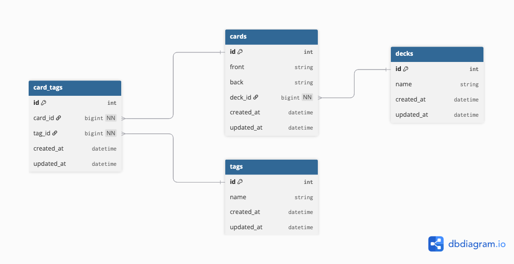

# Flashcard CLI

A simple command-line flashcard app for quickly creating, organizing, and reviewing notecards in your terminal.

## ✨ Features

- Create, view, update, and delete flashcards
- Organize cards into decks
- Add and manage tags for categorizing cards
- Study cards by deck or tag
- Lightweight CLI interface — no internet required

## 📦 Models

- **Deck** – Group of related flashcards (e.g., "Ruby Basics")
- **Card** – Individual flashcards with front/back text
- **Tag** – Categorization for cards (e.g., "Loops", "OOP")
- **CardTag** – Join table between cards and tags
- _User_ – Stretch goal for personal accounts and privacy
- _QuizSession_ – Stretch goal for interactive quiz sessions with scoring

## 🛠️ Setup

1. **Clone the repo**

   ```bash
   git clone git@github.com:mclancy96/phase-3-ruby-project.git
   cd flashcard-cli
   ```
2. **Install dependencies**

   ```bash
   bundle install
   ```
3. **Set up the database**

   ```bash
   rake db:create
   rake db:migrate
   rake db:seed # Optional: add sample data
   ```
4. **Run the Server**

   ```bash
   bundle exec rake server
   ```
5. **Run the app**

   In a separate terminal while the server is still running, run:

   ```bash
   ruby cli/main.rb
   ```

## 🚀 Usage

Once launched, you’ll be able to:

- Create decks and add cards
- View and flip flashcards
- Add tags to organize content
- Search or review by tag or deck

Example flashcard display:

```bash
┌─────────────────────────────────────┐
│ FRONT                               │
│ What is DevOps?                     │
└─────────────────────────────────────┘
┌─────────────────────────────────────┐
│ BACK                                │
│ Practice combining software         │
│ development and IT operations       │
└─────────────────────────────────────┘
```

## 🗺️ ERD



## 📋 User Stories

See [`user-stories.md`](user_stories.md) for a full list of user scenarios supported by this app.

## 🎯 Stretch Goals

- Multi-user support with authentication
- Study tracking and scoring
- Spaced repetition scheduling
- Export/import flashcards
- Interactive quiz sessions with scoring and progress tracking

## 📄 License

MIT License
